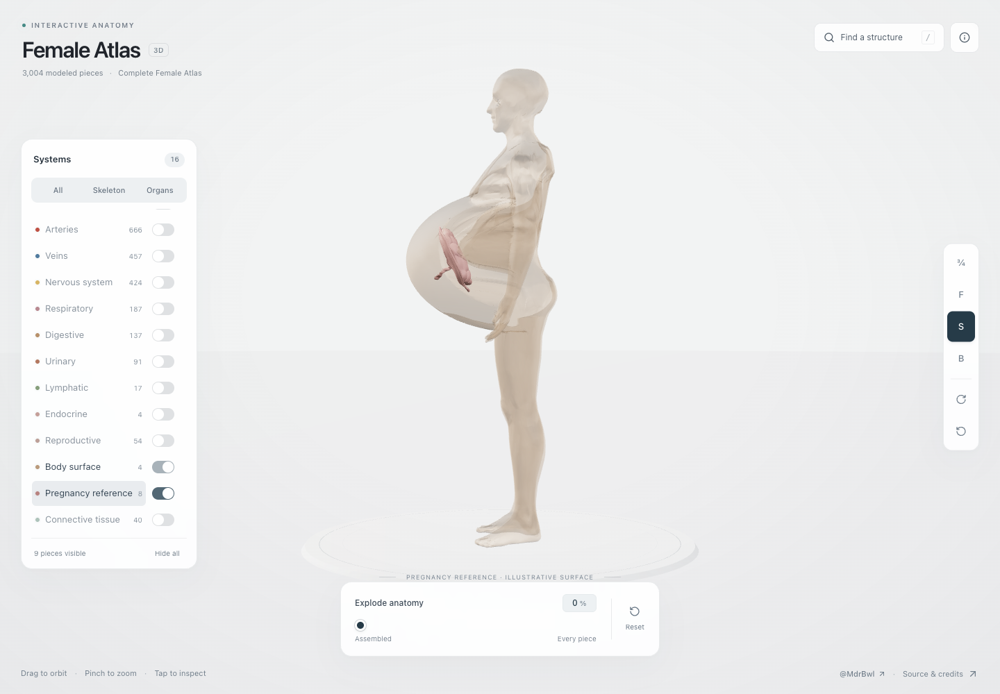

# Female Atlas

An interactive, full-depth 3D anatomy explorer built with React, Three.js, and shadcn/ui. Explore the complete reference female anatomy across **3,004 individually selectable pieces**, **2,557 named anatomical structures**, and **16 human body systems**.

Created by **Mahendra Beniwal** ([@MdrBwl on X](https://x.com/MdrBwl)).

---

## Features

- **Complete Female Anatomy**:
  - **100% Female Reproductive System**: Uterus (10 detailed segments), ovaries, fallopian tubes, cervix, and vagina.
  - **Breast & Mammary Structures**: 16 individually modeled mammary gland lobes, adipose tissue, lactiferous ducts, sinuses, and nipples.
  - **Pregnancy Reference**: Placenta and umbilical cord reference structures.
- **Full Musculoskeletal System**:
  - **Full Skeleton (343 pieces)**: Cranium, facial bones, mandible, hyoid, vertebral column, complete rib cage, clavicles, scapulae, arms, hands, pelvis, femur, patella, tibia, fibula, and feet.
  - **Full Musculature (416 pieces)**: Biceps, triceps, deltoids, pectorals, obliques, rectus abdominis, gluteus (maximus, medius, minimus), quadriceps, hamstrings, gastrocnemius, soleus, and foot/hand muscles.
- **Authentic Female Morphology**:
  - Slender feminine shoulders and neck.
  - Delicately tapered conical rib cage.
  - Graceful hourglass waistline indentation ($\approx 0.65$ waist-to-hip ratio).
  - Flared feminine pelvic hips and rounded glutes.
  - Natural female breast contours that seamlessly enclose the mammary glands.
- **Dynamic 3D Navigation**:
  - **Cursor-Centric Zoom ("Zoom-to-Cursor")**: Mouse wheel scrolling zooms directly into the anatomical structure under your cursor.
  - **Anatomical Explosion**: Smoothly slide from the fully assembled body to an organized, non-overlapping spatial inventory of every piece.
  - **Structure Isolation & Search**: Instant combobox search for structures with quick isolation and contextual anatomical descriptions.
  - **Multi-System Layers**: Toggle any of the 16 body systems with quick presets for All, Skeleton, and Visceral Organs.

---

## 16 Anatomical Systems

| System | Pieces | Description |
| :--- | :--- | :--- |
| **Skeletal** | 343 | Cranium, spine, thoracic cage, upper & lower limbs |
| **Muscular** | 416 | Complete superficial and deep muscular system |
| **Arterial** | 666 | Systemic arterial network from aorta to digital arteries |
| **Venous** | 413 | Superficial and deep venous return networks |
| **Reproductive** | 54 | Uterus, ovaries, fallopian tubes, vagina, breasts, nipples |
| **Pregnancy** | 8 | Placenta and umbilical reference structures |
| **Cardiac** | 58 | Heart chambers, myocardium, valves, and great vessels |
| **Digestive** | 158 | Gastrointestinal tract, liver, pancreas, and spleen |
| **Respiratory** | 189 | Lungs, bronchial tree, trachea, and larynx |
| **Urinary** | 93 | Kidneys, ureters, female bladder, and urethra |
| **Nervous** | 434 | Brain, cerebrum, cerebellum, spinal cord, cranial nerves |
| **Sensory** | 98 | Eyes, optical apparatus, inner ear structures |
| **Endocrine** | 7 | Thyroid, parathyroid, and adrenal glands |
| **Lymphatic** | 17 | Lymph nodes and lymphatic drainage pathways |
| **Integumentary** | 5 | Body surface skin, eyebrows, head hair, and lips |
| **Connective** | 46 | Ligaments, articular disks, and joint capsules |

---

## Run Locally

Requires Node.js 22.13 or newer. No API keys or accounts are needed.

```sh
npm ci
npm run dev
```

Open [http://localhost:3016](http://localhost:3016) in your browser.

To build the production bundle:

```sh
npm run build
```

The output will be in the `dist/` directory.

---

## Validation & Verification

### Pregnancy reference surface

When a placenta or umbilical structure is visible (including search and isolation),
the viewer displays a translucent, rounded abdominal surface around it. Clearing
the selection restores the original skin when the pregnancy layer is also hidden.
The body-surface toggle stays on as context while pregnancy structures are
visible; reset follows the existing default layers.

This is an illustrative envelope, not a gestational-age model or a simulation of
uterine/internal-organ changes. Original model binaries remain unchanged. The
refined surface and neutral geometry are cached and shared by rendering and picking.



```sh
npm run check                  # TypeScript typecheck (0 errors)
node scripts/validate-atlas.mjs        # Checks all 3,004 meshes, buffers, and concepts
node scripts/validate-interactions.mjs # Validates explosion packing & pointer gestures
npm run test:pregnancy                # Actual-mesh containment, topology and state tests
```

The pregnancy tests also run after `npm run build`. With the viewer running and
Playwright available, `npm run e2e:pregnancy` checks selection, layers, isolation,
restoration, zoom, and mobile behavior. Set `PREGNANCY_TEST_URL` to the viewer URL
(default `http://localhost:3016/`) and, if needed, `PLAYWRIGHT_MODULE` to an existing
Playwright module path. The browser check does not require a new runtime dependency.

---

## Sources & Attribution

- **Human Reference Atlas (HuBMAP)**: *3D Reference Organ Set for Female v1.5* (2023) by Kristen Browne and Heidi Schlehlein. Licensed under [CC BY 4.0](https://creativecommons.org/licenses/by/4.0/). [DOI: 10.48539/HBM352.BTSQ.586](https://doi.org/10.48539/HBM352.BTSQ.586).
- **BodyParts3D**: Database Center for Life Science (DBCLS). Licensed under [CC BY 4.0](https://creativecommons.org/licenses/by/4.0/).
- See [ATTRIBUTION.md](public/ATTRIBUTION.md) for detailed adaptation notes.

---

## Author & Community

- **Author**: Mahendra Beniwal
- **X (Twitter)**: [@MdrBwl](https://x.com/MdrBwl)

Issues and pull requests are welcome!

---

## License

Application source code is released under the [MIT License](LICENSE). Anatomical datasets retain their respective [CC BY 4.0](https://creativecommons.org/licenses/by/4.0/) licenses.
